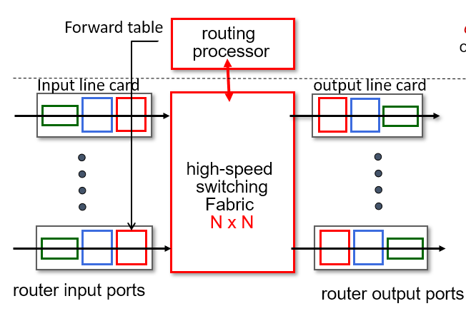
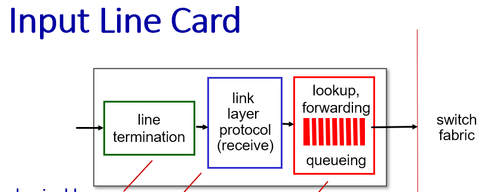
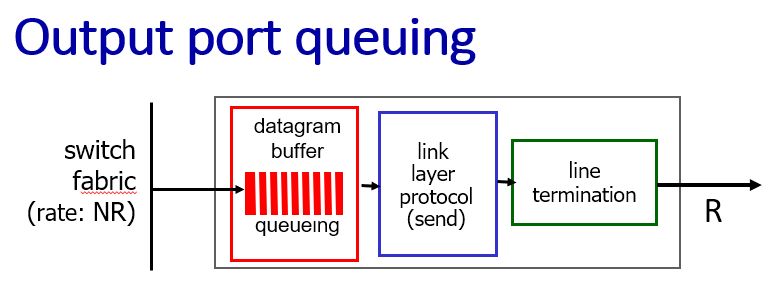
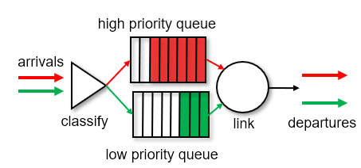

# Network QoS and Congestion Control Design

## Overview

Computer networking project about congestion management, delay-based control, router buffering, QoS classification, CDN placement, and DASH-style adaptive streaming.

## Technical Highlights

- Compared delay-based congestion control with AIMD.
- Analyzed CWND behavior, RTTmin, bottleneck queues, and TCP flow control.
- Designed router QoS changes using packet classification and priority scheduling.
- Discussed CDN server selection and DASH adaptation.

## Tech Stack

Computer Networks, TCP, QoS, DASH, CDN, Router Architecture

## Results

- Delay-based control reacts before packet loss by observing RTT growth.
- QoS design prioritizes video packets through classifier and output scheduling.
- DASH integration improves smooth playback under changing bandwidth.

## How to Run or Review

- Review the extracted diagrams in `assets/images` and the technical summary.

## Repository Notes

- This repository is prepared as a clean public GitHub portfolio version.
- Original course reports that contain student IDs or private details are not committed.
- The committed material focuses on source code, safe visuals, result screenshots, and a technical summary.

## Visuals

## Full Project Package

This repository now includes the complete public project package:

- `docs/full_report_redacted.md` - full technical report text with private identifiers removed.
- `assets/full_report_media/` or `assets/full_report_pages/` - report figures/pages where available.
- Project source/configuration folders where the original project included runnable code or design files.

Original raw report archives are not committed because they can contain private student metadata in covers, headers, or document properties.

## Public File Coverage

See `docs/public_file_coverage.md` for the complete list of public-safe project files included and the raw/private material intentionally excluded.
